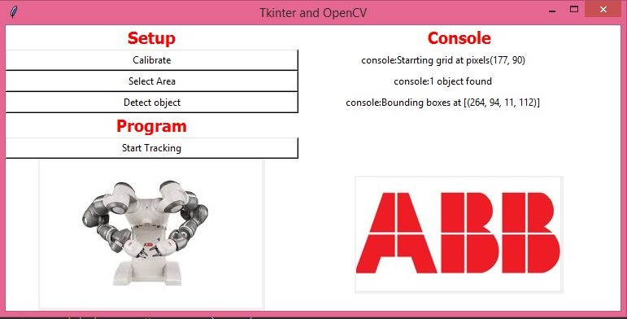

# Robot-Vision---ABB-internship

## Getting Started
For instructions please refer to the [PDF](https://github.com/skrish30/Robot-Vision---ABB-internship/blob/master/Robot%20Vision%20Instructions.pdf)
Demonstration\
https://drive.google.com/file/d/17jcVeuW_A-8GGKrKOHcVvj2hssJEaV9c/view?usp=sharing

### Dependencies

What things you need to install the software and how to install
numpy, cv2, matplotlib, scipy, PIL, tkinter, imutils

### Installing

## Built With
Python 3.5\
Open CV 4.1.1

## Authors

Subhakrish Krishnamra - [Github](https://github.com/skrish30/Robot-Vision---ABB-internship)

## Acknowledgments
ABB Thailand - RARO department\
Mr.Lumboon Simakajornboon\
Mr.Akkachai Sukporka\
Mr.Thana Cheewasupakorn

